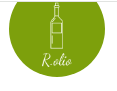

  
  <h1 align="center">R.Olio</h1>
  

 R.Olio is a simple e-commerce web application that streamlines the process of ordering olive oil with various spices for users and small businesses.

## Main Functionality
- Users can choose from four main types of olive oil: 'For Salad', 'Italian', 'For Meat', and 'Eastern'.
- A simple and convenient interface allows users to easily place orders online, selecting the desired quantity and delivery methods.
- Users can leave a message to receive more detailed information about the product or contact via phone or social media.
- All information about products and orders is stored in the database.

## Technologies Used

#### TypeScript :
TypeScript is a superset of JavaScript that adds static typing to the language. It allows developers to catch errors early in the development process and provides enhanced tooling for building scalable and maintainable applications. By adding types to JavaScript, TypeScript helps improve code quality, readability, and developer productivity. Additionally, TypeScript seamlessly integrates with popular JavaScript frameworks and libraries like React, enabling developers to leverage its benefits while building dynamic and high-performance web applications.

#### React :

React is a JavaScript library for building user interfaces, enabling you to
create dynamic and highly performant web applications. Your application is built
on React, making it easy to create components and manage application state.

#### Redux Toolkit :

Redux Toolkit is a library for managing the state of your application in React
projects. It helps organize and simplify state management, centralizing it and
providing debugging tools.

#### Axios :

Axios is a library for making HTTP requests in your React applications, allowing
you to interact with the server, fetch, and send data.

#### React Router DOM :

React Router DOM is a library for navigation and routing in React applications,
enabling the creation of routers and page navigation.

#### Yup :

Yup is a library for data validation in React applications, allowing you to set
validation rules for forms and data, ensuring their correctness.

#### React-Redux :

React-Redux is a library for integrating Redux into your React applications,
simplifying the connection between Redux state and React components.

#### Formik :

Formik is a library for managing forms in React applications, making form
creation and management more convenient and efficient.

#### Framer Motion :
Framer Motion is a JavaScript library designed for creating fluid animations and interactions in React applications. It provides developers with a simple and intuitive API to animate elements, manage complex transitions, and add interactive gestures seamlessly.

## Backend
[R.Olio Frontend](https://github.com/GabriellaMar/rolio-backend)